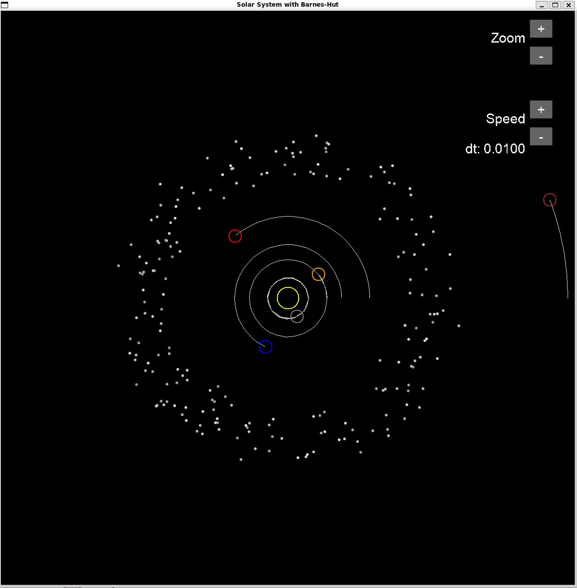
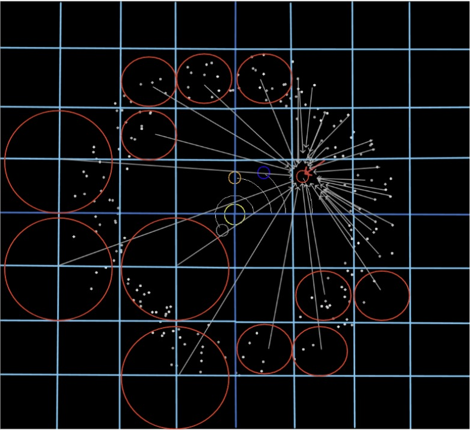

# Solar System Simulation with Barnes-Hut Quad-Tree Algorithm

A real-time N-body gravitational simulation of the solar system with 9 planets and 200 asteroids using efficient Barnes-Hut quad-tree spatial optimization.

<div align="center">
  <div style="display: inline-block; margin-right: 20px;">
    
      <p><b>Solar System</b></p>
  </div>
  <div style="display: inline-block; margin-left: 20px;">
    
      <p><b>Barnes-Hut</b></p>
  </div>
</div>

## 📋 Key Features

This simulation demonstrates advanced computational physics with:

- Barnes-Hut Quad-Tree Algorithm: O(N log N) gravitational calculations using spatial quad-trees (~100x faster than brute-force)
- Solar System: 9 planets with realistic masses and orbital distances
- Dynamic Asteroid Belt: 200 asteroids between Mars and Jupiter
- Real-time Visualization: Interactive SDL2 rendering with planetary trajectory trails
- Interactive Controls: Zoom (40x-400x) and variable speed (0.0001-0.1 time-step)
- Data Logging: Automatic CSV export of simulation data
- 60+ FPS Performance: Efficient quad-tree spatial partitioning for smooth real-time physics

## 🎮 Controls

- Zoom: +/- buttons (top-right corner)
- Speed: +/- buttons (middle-right corner)
- Exit: Close window

## 🏗️ Architecture

The simulation uses a sophisticated quad-tree based approach:

main.c  
├── Data Structures  
│   ├── CelestialBody - Universal body structure for quad-tree  
│   ├── Planet - Solar system planets with orbital data  
│   └── QuadTreeNode - Spatial partitioning for efficient calculations  
├── Barnes-Hut Implementation  
│   ├── create_quadtree() - Spatial tree construction  
│   ├── insert_body() - Dynamic body insertion  
│   ├── calculate_center_of_mass() - Mass distribution calculation  
│   └── calculate_force_from_quadtree() - O(N log N) force computation  
├── Physics Engine  
│   ├── update_body() - Numerical integration (Euler method)  
│   └── update_simulation_barnes_hut() - Main simulation loop  
└── Rendering System  
    ├── render_bodies() - Planet and asteroid visualization  
    ├── DrawButton() - Interactive UI elements  
    └── trajectory rendering - Orbital path display  

## 🛠️ Technologies

- C - High-performance systems programming
- SDL2 - Hardware-accelerated graphics and input
- SDL2_ttf - Font rendering for UI elements
- GCC - GNU Compiler Collection

## ⚙️ Installation & Setup

**Prerequisites**  
First, install the SDL2 development library:  

Ubuntu/Debian:  

```bash
sudo apt update  
sudo apt install libsdl2-dev  
```

macOS (using Homebrew):
  
```bash
brew install sdl2
```

**Compilation**  
Compile using the provided Makefile:  

```bash
make
```

**Running the Simulation**  
Execute the compiled binary:  

```bash
./solar_system
```
